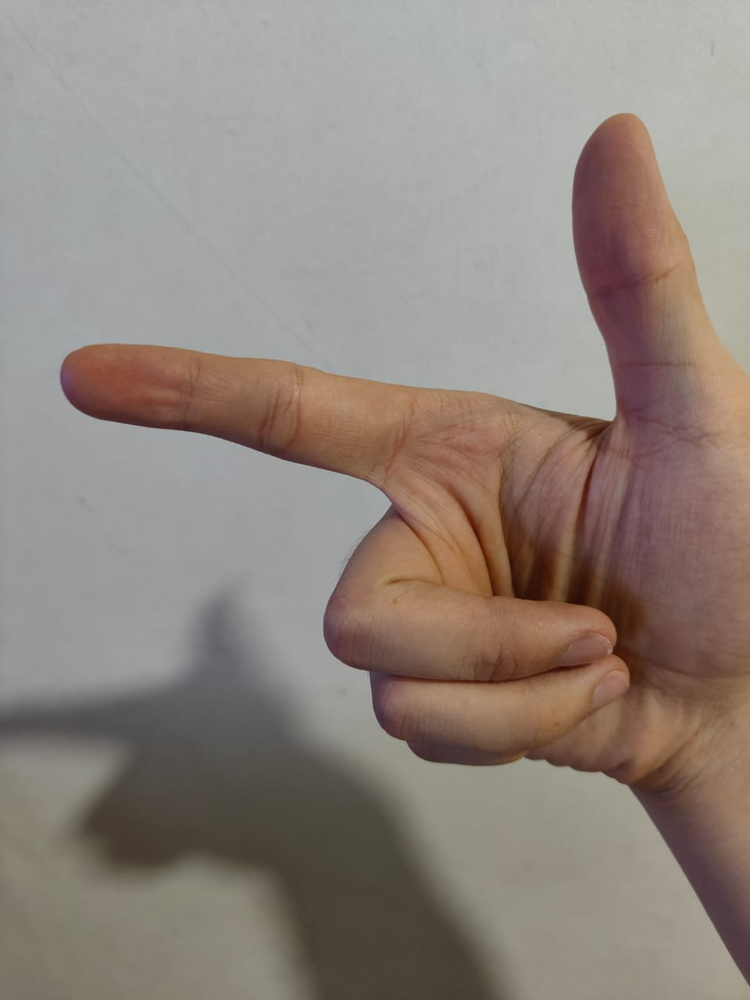
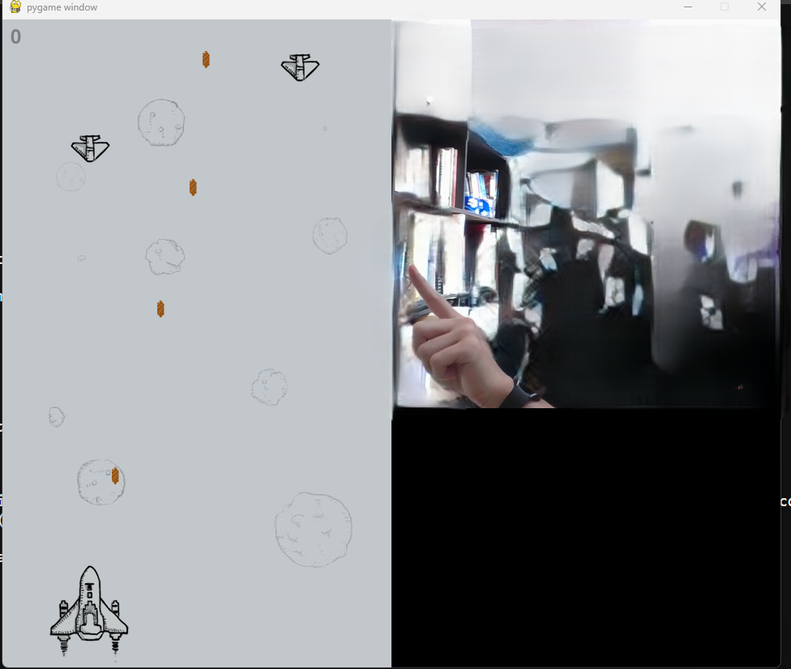

# AIRCRACFT WITH HAND GESTURE DETECTION

## What can this do?
You can perform the classic aircraft minigame with your finger:


## How to start
1. excute the createEnv.bat
```
createEnv.bat
```
2. active the enviroment and enjoy the game
```
aircraft\Scripts\activate
python app.py
```

## DEMO


